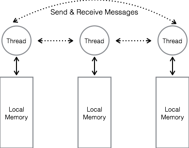
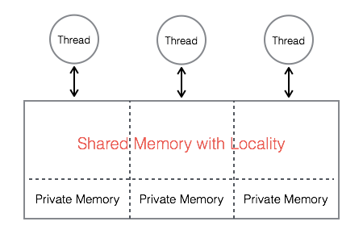
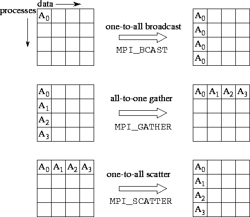

# Message Passing Interface

### Parallel Programming Model
It is an abstract view of data and execution.
* **Message Passing** : MPI
  * Two-sided communication (significant communication overhead for small transactions)
  * Single Program Multiple Data
  * With locality awareness
  * Ghost cell problem



* **Shared Memory** : OpenMP
  * Simple read & write on global memory (Simplified code development)
  * Without locality awareness
  * Manipulating shared data requires synchronization


* **Distributed Shared Memory** : UPC, Titanium, X10 (not widely used)


--------------------------------
**Note**:
* MPI is a library, not a language. MPI can be linked with C, C++, Fortran
* MPI-2 is the current version, MPI-3 is under developement

### Six Basics to Start with MPI
* **MPI_Init**      :		 Initiate an MPI computation.
* **MPI_Finalize**  :		 Terminate a computation.
* **MPI_Comm_size** :   Determine number of processes.
* **MPI_Comm_rank** :		 Determine my process identifier.

MPI Hello World
```
#include <stdio.h>
#include <mpi.h>
int main(int argc, char *argv[]) {

int rank, size;
MPI_Init(&argc, &argv); 
MPI_Comm_rank(MPI_COMM_WORLD, &rank); 
MPI_Comm_size(MPI_COMM_WORLD, &size); 

/* ... your code here ... */

printf(“Hello from node %d of %d\n”, rank, size) 
MPI_Finalize();
return 0;
}
```
MPI defines a default communicator called MPI_COMM_WORLD which includes all the processes. A communicator defines a domain of communication.

* **MPI_Send**(void *buf, int count, MPI_Datatype datatype, int dest, int tag, MPI_Comm comm)
* **MPI_Recv**(void *buf, int count, MPI_Datatype datatype, int source, int tag, MPI_Comm comm, MPI_Status *status)

**MPI_Send** sends contents of `buf`, containing `count` instances of `datatype` the process specified by the envelope information. (Terminology envelope information compared to postal service). 

**MPI_Recv** receives `count` instances of `datatype` into `buf` from process given by envelope information, and return information on `status`.

The received message tag is `status.MPI_TAG` and the rank of the sending process is `status.MPI_SOURCE`.
```
if (taskid < numtasks/2) {
  partner = numtasks/2 + taskid;
  MPI_Send(&taskid, 1, MPI_INT, partner, 1, MPI_COMM_WORLD);
  MPI_Recv(&message, 1, MPI_INT, partner, 1, MPI_COMM_WORLD, &status);
  }
else if (taskid >= numtasks/2) {
  partner = taskid - numtasks/2;
  MPI_Recv(&message, 1, MPI_INT, partner, 1, MPI_COMM_WORLD, &status);
  MPI_Send(&taskid, 1, MPI_INT, partner, 1, MPI_COMM_WORLD);
  }
```
### Avoiding Deadlocks
What will happen if we change the sequence of Send & Recv
```
if (taskid < numtasks/2) {
  partner = numtasks/2 + taskid;
  MPI_Send(&taskid, 1, MPI_INT, partner, 1, MPI_COMM_WORLD);
  MPI_Recv(&message, 1, MPI_INT, partner, 1, MPI_COMM_WORLD, &status);
  }
else if (taskid >= numtasks/2) {
  partner = taskid - numtasks/2;
  MPI_Send(&taskid, 1, MPI_INT, partner, 1, MPI_COMM_WORLD);
  MPI_Recv(&message, 1, MPI_INT, partner, 1, MPI_COMM_WORLD, &status);
  }
```
Send and Recv are "blocking" until the local buffer is empty (send) or full (recv). So, the following code is correct.
```
MPI_Send(&mybuffer, num_items,...);
for(i=0; i<num_items; i++) { 
   mybuffer[i] = 0;
}
```

Another method to avoid deadlock is using **Asyncronous Send and Recv**
* int MPI_Isend(*buf, count, MPI_Datatype, dest, tag, comm, MPI_Request *request)
* int MPI_Irecv(*buf, count, MPI_Datatype, source, tag, comm, MPI_Request *request)


### How to get good speedup
* avoid having all processes wait while one of them does some work, avoid sequential bottlenecks
* distribute data and work evenly
* but... the biggest issue is **Communication**

Simplest Communication Time Model (time between send and completion of receive):

T_comm(n) = a + b*n    for an n-byte message, and a >> b
* send less data, combine data into a longer message, send fewer message

### Data Movement 
**MPI_Bcast**, **MPI_Gather**, **MPI_Scatter** are collective data movement routines, in which all processes interact with a distinguished root process to broadcast, gather, or scatter data, respectively. 



### A Finite Difference Example: 1D Heat Equation
