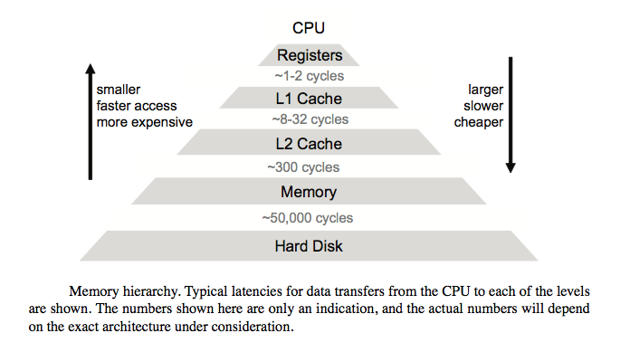
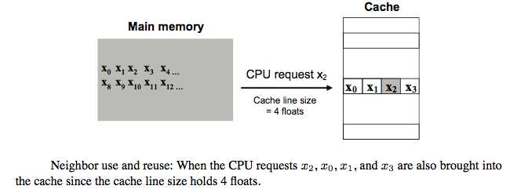
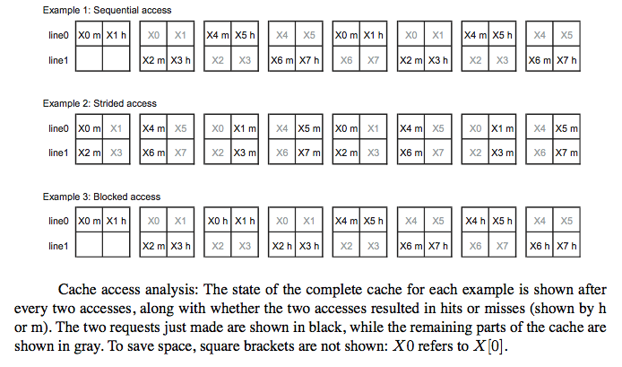
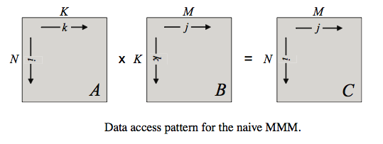
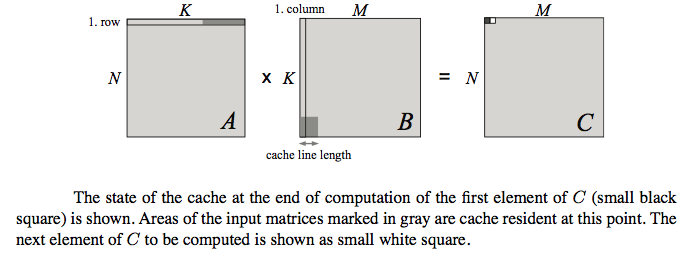
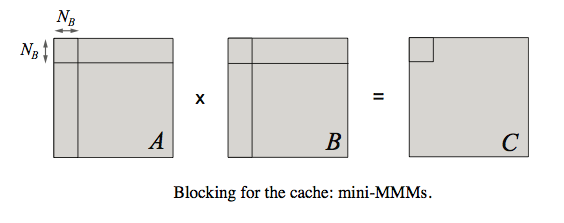

# Cache Optimization

*Material in this document is heavily borrowed from the excellent paper by 
Chellappa et al., [How to write fast numerical code: A small introduction.]
(http://users.ece.cmu.edu/~franzf/papers/gttse07.pdf)*

## Terminology

All of the data that we create in a program is store in memory. When we 
allocate memory using the `malloc` or `new` commands, they reserve space in the 
**RAM** or **main memory** and store the relevant data in that space.

Whenever a computation needs to be performed on some data, they need to be 
moved from the main memory (RAM) to **registers**, which are memory locations 
on the CPU. The CPU then performs the required calculation and stores the 
result appropriately.

The **memory bandwidth** is the speed at which data can be moved from the main
memory to the CPU (or the speed at which data can be written to the main 
memory). This is usually measured in **bytes per second**.
 
When dealing with numerical code, the computations performed by the CPU are 
mostly arithmetic operations (such as addition and multiplication) on floating
point numbers. One of the metrics of the speed of a CPU is the rate at which 
it can perform these operations, measured in **floating point operations per 
second, or FLOPS**.

## History

The following plots have been taken from v6.5 of the CUDA C programming guide. 
They show the change in the theoretical CPU performance and memory bandwidth 
(which loosely translate to the maximum possible FLOPs and GB/s performance 
that we can expect) of NVIDIA GPUs and Intel CPUs over time:

<center></center>

* **Fig 1:** FLOPS v. Time (from *NVIDIA CUDA C Programming Guide V6.5*)

<center></center>

* **Fig 2:** Memory Bandwidth v. Time (from *NVIDIA CUDA C Programming Guide v6.5*)

We can clearly see that the rate at which the memory bandwidth has increased 
over time is much slower than the rate at which the computational speed has 
increased. In the period 2004-2013, the FLOP count for the NVIDIA GPUs has 
increased by more than 2 orders of magnitude, but the memory bandwidth has only 
increased by one order of magnitude. The trend is similar for the Intel 
processors.

What this means is that computational power is getting cheaper, and the real 
bottleneck is the memory.

## Arithmetic intensity

A consequence of the above  is that programs that perform a large number of 
computations on small amounts of data can be optimized to run very fast on 
modern hardware, compared to programs that perform a few computations on a 
large amount of data. This is because for the latter, the majority of the time 
is going to be spent transferring data from the memory to the CPU, which is 
slow.

The former type of program or application is said to be **CPU-bound**, and the 
latter is said to be **memory-bound**. A good indicator of the type of program 
is the ratio of the total number of floating point operations a program must 
perform to the size of the data on which those computations are performed. This 
is also known as the **arithmetic intensity** of the problem, measured in 
**floating point operations per byte or FLOP/byte**.

For example, calculating the product of two *N x N* matrices requires *2N^3* 
floating point operations (for every element of the product, we require N 
multiplications and N additions). The total number of inputs is *2N^2* (*N x 
N* for each input matrix). The complexity of the operation is O(N^3), the size 
of the data on which the operation is performed is O(N^2), and hence the 
arithmetic intensity is O(N). This is a classic CPU-bound problem. 

Another example is a simple finite-difference code to calculate unsteady heat 
diffusion. At every time step, a 3-D central-difference Poisson stencil will 
iterate through every point in the domain, and use the values from that point 
and six surrounding points, multiply them with appropriate coefficients and sum 
them all up. This means that 14 floating point operations (7 multiplies and 7 
adds) are performed per element, i.e. the arithmetic intensity is O(1). This 
problem is memory-bound.

More information on how this affects the performance of numerical codes on 
various hardware is given in the paper that introduced the [Roofline Model]
(http://www.eecs.berkeley.edu/Pubs/TechRpts/2008/EECS-2008-134.pdf), by 
Williams, Waterman and Patterson.

## Memory Hierarchy

Computer engineers have sought to ameliorate the wide gap between computational 
and memory speeds through the introduction of a memory hierarchy. Aside from 
the main memory, CPUs also come with smaller quantities of high-speed memory 
known as **cache**. If data required by the CPU is already present in the 
cache, then it can be accessed very quickly compared to the RAM (by a few orders
of magnitude) for the computations, and the overall time taken by the code is 
reduced. The size of the cache is usually a few orders of magnitude smaller 
than the size of the RAM, and can only hold small parts of the total data at a 
time. The programmer must write the code in such a way that the cache is used 
in the best way possible to make the program run fast. Modern CPUs usually have 
multiple levels of cache.

<center></center>

* **Fig 3:** Memory Hierarchy in computers (from *How to write fast numerical 
  code*)

The memory hierarchy has been designed this way to make use of two important 
ideas:

**Temporal locality**: If a memory location has been accessed by the CPU, then 
it will be accessed again in the near future.

**Spatial locality:** If a memory location has been accessed by the CPU, then 
nearby memory locations will be accessed by the CPU in the near future.

These can be observed in simple algorithms: Calculating the first row of a 
matrix-matrix product requires repeated access to the first row of the first 
input matrix. And the first row itself is accessed sequentially, i.e. 
neighbouring elements are accessed one after another.

Once a chunk of data is copied to the cache, it is advantageous to reuse that 
data for as long as possible, since the access to that data is quick. It as also 
advantageous to perform the calculations on any of the data in the cache by 
using data from nearby neighbors that are also in the cache. Algorithms can be 
modified, and memory accesses can be reordered to take advantage of data reuse 
(temporal locality) and neighbour use (spatial locality).

## How cache works

Every time the CPU requests data that is available in the cache, that is termed
a **hit**, and every time the data is not present in the cache and must be 
fetched from the main memory, it is termed a **miss**. A miss can be be of 
the order of 100 CPU cycles (see Figure 3), during which valuable computational 
time is lost. Another way to describe the objective of a programmer who needs 
to speed up serial code is to **minimize the ratio of cache misses to cache 
hits.**

The cache is populated in groups of data known as **cache lines**. Every time 
data from a specific memory location is accessed, all the data that belongs to
the same cache line in adjacent memory locations is copied over to the cache.
This is done to take advantage of spatial locality.

<center></center>

* **Fig 4:** How cache lines are written to cache (from *How to write fast 
  numerical code*)

Cache is designed such that every location in the main memory is mapped to
specific locations in the cache. Since the cache is much smaller than the main 
memory, this means that more than one main memory location must be mapped to 
the same locations in cache. A direct-mapped cache is one in which every 
location in main memory is mapped to exactly one location in cache. So 
when the code needs to access two memory locations that are mapped to the same 
cache location, the data that was copied first is overwritten by the new data. 
The cache can also be designed to be *k*-way associative, which means that the 
main memory locations are mapped to *k* different cache locations. If some data 
is read, and the first cache location that is is mapped to is already occupied, 
then it will be copied it in any of the other *k-1* locations, according to a 
prescribed set of rules.

<center></center>

* **Fig 5:** Direct-Mapped and 2-Way associative caches (Credit: 
User [Hellisp on Wikipedia]
(http://commons.wikimedia.org/wiki/File:Cache,associative-fill-both.png))

Associativity is a trade-off. If there are *k* possible locations in the cache 
that correspond to the main memory location, then the CPU will have to go 
through them in a prescribed manner to detect a hit. This slows down the time 
for a hit. But at the same time, increasing the associativity may decrease the 
probability of a cache miss by reducing the number of conflicts in the cache.

## Optimize: Accessing an array

*This example is taken from How to write fast numerical code*.

Suppose we had an array of floating point numbers of size 8, and wanted to 
access each element twice. Also suppose that the total size of the cache is 4 
floats, each cache lines holds 2 floats, and it is direct-mapped. We could 
access the elements in the following ways:

#### 0123456701234567

This would be the standard way in which we write our loop:

```C
for(int k=0; k<2; k++)
	for(int i=0; i<8; i++)
		read(a[i])
```

Let us count the hits and misses. The first read will be a compulsory miss, and 
will transfer both element 0 and 1 to the cache. So a[1] will be a hit. But a[2]
will be a miss. When a[4] is read, the first line will have to be replaced with 
elements 4 and 5. And when a[0] is read again, elements 0 and 1 will occupy the 
first line again. The hit and miss pattern in this case will be 
MHMHMHMHMHMHMHMH. 50% of the reads are misses.

#### 0246135702461357

```C
for(int k=0; k<2; k++)
{
	for(int i=0; i<8; i+=2)
		read(a[i])
	for(int i=1; i<8; i+=2)
		read(a[i])
}
```
 
In this sequence, we first read all the elements with even indices, and then 
the elements with odd indices, and then repeat. When a[0] is read, it is a 
cache miss and elements 0 and 1 are copied into the cache. But the next element 
read is 2, which will also result in a miss. And so on. And when a[1] is read, 
the cache line with a[0] and a[1] will need to be copied to the cache again. In 
this case, every read will be a miss: MMMMMMMMMMMMMMMM. We observe here that 
accessing every alternate element in the array, i.e. accessing the array with a 
stride of 2, results in more misses. **As a general principle, strided access 
in most applications will result in more cache misses.**

#### 0123012345674567

```C
for(int i=0; i<8; i+=4)
	for(int k=0; k<2; k++)
		for(int ii=i; ii<i+4; ii++)
			read(a[ii])
```

We have cold misses when a[0] and a[2] are accessed, but elements 0-3 are 
accessed again. During the second time, all four elements are present in the 
cache, and all access will result in hits. The same happens during the next 
eight accesses on the second half of the array. Our hit and miss sequence will 
be HMHMHHHHHMHMHHHH.

This access sequence makes the best use of both spatial and temporal locality. 
By accessing the elements in order (i.e. with a stride of 1), the pattern *makes 
use of neighbor elements*. And the pattern also sees *data reuse* by accessing 
the elements that are in the cache repeatedly until they are no longer needed. 

The concept of copying a certain amount of contiguous data to the cache and 
reusing it is known as **blocking**. This is the most common way to optimize 
cache usage. The programmer must always look to split the data into pieces that 
can fit in the cache and work with them as long as required. This will minimize 
the number of cache misses when running the code.

<center></center>

* **Fig 6:** An illustration of the above exercise (from *How to write fast 
  numerical code*)

## Optimize: Dense Matrix-Matrix Multiplication (MMM)

Read Section 4.2 of *How to write fast numerical code* for general tips on 
cache optimization. 

Section 5 discusses the shortcomings of the naive implementation of the MMM 
algorithm, shown here (for *N x N* matrices, and the exact operation being 
computing the product and adding it to the existing product matrix: *C+=AB*):

```C
for(i=0; i<N; i++)
	for(j=0; j<N; j++)
		for(k=0; k<N; k++)
			C[i][j] += A[i][k] * B[k][j];
```

<center></center>

* **Fig 7:** An illustration of the naive MMM algorithm (from *How to write fast 
  numerical code*)

<center></center>

* **Fig 8:** An illustration of the cache state at the end of calculated the 
first element of the product matrix (from *How to write fast numerical code*)

Section 5.1 discusses strategies to optimize cache usage in MMM, the most 
important being blocking:

```C
for(i=0; i<N; i+=BS)
	for(j=0; j<N; j+=BS)
		for(k=0; k<N; k+=BS)
			for(ii=i; ii<i+BS; ii++)
				for(jj=j; jj<j+BS; jj++)
					for(kk=k; kk<k+BS; kk++)
						C[ii][jj] += A[ii][kk] * B[kk][jj];
```
<center></center>

* **Fig 9:** An illustration of the mini MMMs that come about from blocking the 
MMM code (from *How to write fast numerical code*)

## References

[1] [How To Write Fast Numerical Code: A Small Introduction]
(http://users.ece.cmu.edu/~franzf/papers/gttse07.pdf). Srinivas Chellappa, 
Franz Franchetti, and Markus Puschel

[2] [CUDA C Programming Guide]
(http://docs.nvidia.com/cuda/cuda-c-programming-guide/). NVIDIA Documentation

[3] [Roofline: An Insightful Visual Performance Model for Floating-Point 
Programs and Multicore Architectures]
(http://www.eecs.berkeley.edu/Pubs/TechRpts/2008/EECS-2008-134.pdf). 
S. W. Williams, A. Waterman and D. A. Patterson
