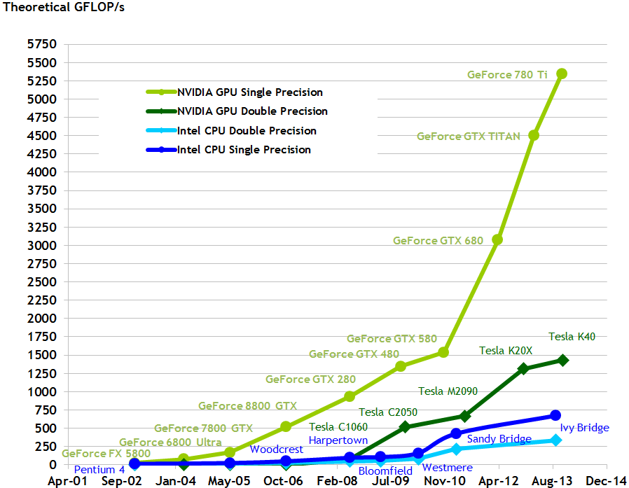
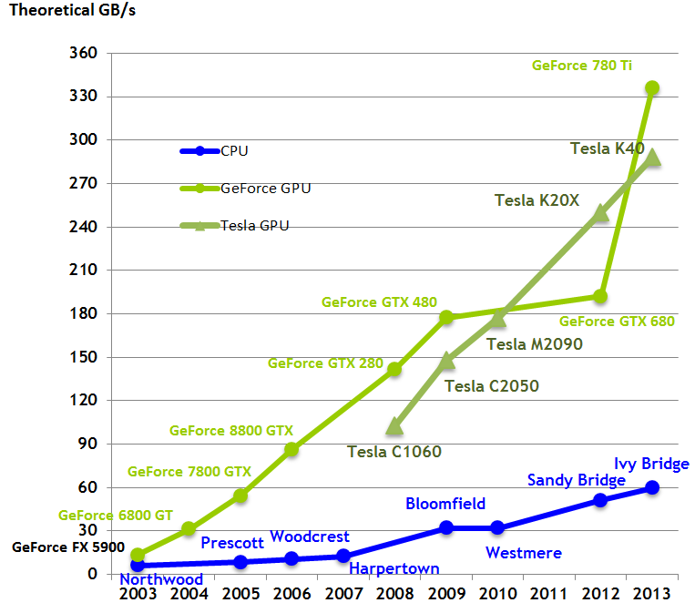

# Cache Optimization

## Terminology

All of the data that we create in a program is store in memory. When we 
allocate memory using the `malloc` or `new` commands, they reserve space in the 
**RAM** and store the relevant data in that space.

Whenever a computation needs to be performed on some data, they need to be 
moved from the main memory (RAM) to **registers**, which are memory locations 
on the CPU. The CPU then performs the required calculation and stores the 
result appropriately.

The **memory bandwidth** is the speed at which data can be moved from the main
memory to the CPU (or the speed at which data can be written to the main 
memory). This is usually measured in **bytes per second**.
 
When dealing with numerical code, the computations performed by the CPU are 
mostly arithmetic operations (such as addition and multiplication) on floating
point numbers. One of the metrics of the speed of a CPU is the rate at which 
it can perform these operations, measured in **floating point operations per 
second, or FLOPS**.

## History

The following plots have been taken from v6.5 of the CUDA C programming guide. 
They show the change in the theoretical CPU performance and memory bandwidth 
(which loosely translate to the maximum possible FLOPs and GB/s performance 
that we can expect) of NVIDIA GPUs and Intel CPUs over time:

We can clearly see that the rate at which the memory bandwidth has increased 
over time is much slower than the rate at which the computational speed has 
increased. In the period 2004-2013, the FLOP count for the NVIDIA GPUs has 
increased by more than 2 orders of magnitude, but the memory bandwidth has only 
increased by one order of magnitude. The trend is similar for the Intel 
processors.

What this means is that computational power is getting cheaper, and the real 
bottleneck is the memory.

## The Roofline Model

A consequence of the above  is that programs that perform a large number of 
computations on small amounts of data can be optimized to run very fast on 
modern hardware, compared to programs that perform a few computations on a 
large amount of data. This is because for the latter, the majority of the time 
is going to be spent transferring data from the memory to the CPU, which is 
slow.

The former type of program or application is said to be **CPU-bound**, and the 
latter is said to be **memory-bound**. A good indicator of the type of program 
is the ratio of the total number of floating point operations a program must 
perform to the size of the data on which those computations are performed. This 
is also known as the **arithmetic intensity** of the problem, measured in 
**floating point operations per byte or FLOP/byte**.

For example, calculating the product of two *N x N* matrices requires *2N^3* 
floating point operations (for every element of the product, we require N 
multiplications and N additions). The total number of inputs is *2N^2* (*N x 
N* for each input matrix). The complexity of the operation is O(N^3), the size 
of the data on which the operation is performed is O(N^2), and hence the 
arithmetic intensity is O(N). This is a classic CPU-bound problem. 

Another example is a simple finite-difference code to calculate unsteady heat 
diffusion. At every time step, a 3-D central-difference Poisson stencil will 
iterate through every point in the domain, and use the values from that point 
and six surrounding points, multiply them with appropriate coefficients and sum 
them all up. This means that 14 floating point operations (7 multiplies and 7 
adds) are performed per element, i.e. the arithmetic intensity is O(1). This 
problem is memory-bound.

More information on how this affects the performance of numerical codes on 
various hardware is given in the paper that introduced the [Roofline Model]
(http://www.eecs.berkeley.edu/Pubs/TechRpts/2008/EECS-2008-134.pdf), by 
Williams, Waterman and Patterson.

## Memory Hierarchy

Computer engineers have sought to ameliorate the wide gap between computational 
and memory speeds through the introduction of a memory hierarchy. Aside from 
the main memory, CPUs also come with smaller quantities of high-speed memory 
known as **cache**. If data required by the CPU is already present in the 
cache, then it can be accessed very quickly compared to the RAM (by a few orders
of magnitude) for the computations, and the overall time taken by the code is 
reduced. The size of the cache is usually a few orders of magnitude smaller 
than the size of the RAM, and can only hold small parts of the total data at a 
time. The programmer must write the code in such a way that the cache is used 
in the best way possible to make the program run fast. Modern CPUs usually have 
multiple levels of cache.

The memory hierarchy has been designed this way to make use of two important 
ideas:

**Temporal locality**: If a memory location has been accessed by the CPU, then 
it will be accessed again in the near future.

**Spatial locality:** If a memory location has been accessed by the CPU, then 
nearby memory locations will be accessed by the CPU in the near future.

These can be observed in simple algorithms: Calculating the first row of a 
matrix-matrix product requires repeated access to the first row of the first 
input matrix. And the first row itself is accessed sequentially, i.e. 
neighbouring elements are accessed one after another.

Once a chunk of data is copied to the cache, it is advantageous to reuse that 
data for as long as possible, since the access to that data is quick. It as also 
advantageous to perform the calculations on any of the data in the cache by 
using data from nearby neighbors that are also in the cache. Algorithms can be 
modified, and memory accesses can be reordered to take advantage of data reuse 
(temporal locality) and neighbour use (spatial locality).

## How cache works

Every time the CPU requests data that is available in the cache, that is termed
a **hit**, and every time the data is not present in the cache and must be 
fetched from the main memory, it is termed a **miss**. A **miss** can be be of 
the order of 100 CPU cycles, during which valuable computational time is lost. 
Another way to describe the objective of a programmer who needs to speed up 
code is that the ratio of cache misses to cache hits must be minimized.

* Cache lines, associativity
* Cache optimization
* Register optimization	